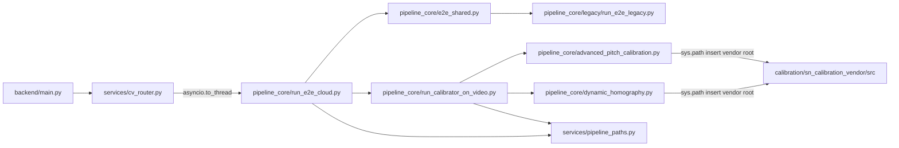

# Backend architectural audit and restructuring blueprint

This document is the **approved architectural audit** for production readiness. It was produced from a static import trace of `backend/`, cross-checked against **graphify** artifacts under `graphify-out/` (see [Graphify evidence](#graphify-evidence-quantitative-cross-check)).

---

## Executive summary (blunt)

The **local production CV path** (`LocalCVRunner` in [`backend/services/cv_router.py`](backend/services/cv_router.py) → lazy `run_e2e_cloud`) was **not quarantine-clean** at audit time: the homography stack **mutated `sys.path` and imported Python modules from** [`backend/references/sn-calibration`](backend/references/sn-calibration) (`from src.soccerpitch import SoccerPitch`, `from src.detect_extremities import ...`, `from src.baseline_cameras import ...`). That was a **hard Rule 1 violation**: production execution depended on third-party source trees inside `references/`.

**Remediation implemented in this branch:** SoccerNet `src/` is **vendored** under [`backend/calibration/sn_calibration_vendor/src/`](backend/calibration/sn_calibration_vendor/src/) and production code loads it from **`backend/calibration/`** only—**not** from `backend/references/`. Default homography **weights** resolve under **`backend/models/calibration/sn-calibration/resources/`** (override with `SN_CALIBRATION_RESOURCES_DIR`). `backend/references/sn-calibration` remains an optional upstream mirror for diffs and attribution; it is no longer on the runtime import path for the pipeline.

Configuration previously **anchored production behavior to `references/`** via [`backend/services/pipeline_paths.py`](backend/services/pipeline_paths.py) and [`backend/scripts/pipeline_core/run_calibrator_on_video.py`](backend/scripts/pipeline_core/run_calibrator_on_video.py). Those defaults are updated to the vendor + models layout above.

**Domain bleed** was structural: [`backend/main.py`](backend/main.py) imported **`scripts.rag_coach`** and **`scripts.tactical_rule_engine`** directly, while heavy CV lived under the same `scripts/` package as one-off tools. **Restructuring** moves live pipeline scripts under `backend/scripts/pipeline_core/`, utilities under `backend/scripts/auxiliary_tools/`, and moves **RAG + rule engine** into `backend/services/` so the API does not depend on `scripts/` for domain logic.

Philosophy alignment (minimal surface, strict boundaries): **(a)** first-party calibration layout under `backend/calibration/` with **no** imports from `references/` at runtime, **(b)** weights under **`backend/models/calibration/`**, **(c)** `references/` is **read-only upstream mirror** for humans and sync scripts—not a Python import root for production.

---

## Graphify evidence (quantitative cross-check)

**Source artifacts:** [`graphify-out/graph.json`](graphify-out/graph.json) (merged AST + semantic graph from the last graphify run on the repo with `.graphifyignore`), and [`graphify-out/GRAPH_REPORT.md`](graphify-out/GRAPH_REPORT.md) for narrative “surprising connections” and suggested questions.

**Why this improves the audit:** static import grep proves *legal* Python dependencies; the graph additionally surfaces **dense pairwise coupling** (including semantic `uses` / `calls` edges from extraction) so you can **prioritize decoupling** by measured connectivity, not only by folder layout.

**Quarantine breach at the graph layer (Rule 1 corroboration) — pre-refactor baseline:**

- Counted **115** undirected edges whose endpoints tie a node with `source_file` under `backend/scripts/` to a node with `source_file` under `backend/references/`. Sample edge families in the graph matched the code reality: `dynamic_homography` / `advanced_pitch_calibration` rationale and calibrator nodes linked to `detect_extremities.*`, `baseline_cameras.*`, and `soccerpitch.*` under `references/sn-calibration` (and related reference paths). **`generate_calibration`** also appeared linked into reference `camera_*` nodes—consistent with the Spiideo / `soccersegcal` path in code.

**God-node pressure (Rule 4 corroboration) — degree among `backend/scripts/`, `backend/services/`, and `backend/main.py` nodes (baseline graph):**

| Approx. degree | Label | `source_file` |
|---:|---|---|
| 62 | `EngineRoutingError` | `backend/services/errors.py` |
| 46 | `TeamClassifier` | `backend/scripts/pipeline_core/track_teams.py` |
| 46 | `TacticalRadar` | `backend/scripts/pipeline_core/track_teams.py` |
| 45 | `HybridIDHealer` | `backend/scripts/pipeline_core/track_teams.py` |
| 39 | `GlobalRefiner` | `backend/scripts/pipeline_core/global_refiner.py` |
| 38 | `GeneratedPromptRecord` | `backend/services/rag_coach.py` |
| 38 | `run_e2e_legacy.py` (module) | `backend/scripts/pipeline_core/legacy/run_e2e_legacy.py` |
| 37 | `TacticalAnalyzer` | `backend/scripts/pipeline_core/generate_analytics.py` |
| 33 | `main.py` (module) | `backend/main.py` |
| 30 | `run_cv_tracking_batched()` | `backend/scripts/pipeline_core/run_e2e_cloud.py` |

**`SoccerPitch` in the graph:** the extraction produced multiple `SoccerPitch`-related nodes, including **`SoccerPitch` with degree ~106** tied to `backend/references/soccersegcal/sncalib/soccerpitch.py` in addition to nodes under `sn-calibration/src/soccerpitch.py`. Treat the second as **semantic duplication / domain bleed across two upstream pitch models**—after quarantine cleanup you should have **one** first-party pitch-line abstraction; the graph is flagging that today’s mental model is ambiguous.

**Operational note:** Re-run graphify after Phase 1–3 refactors; expect **cross-`references` edge count and SoccerPitch fan-in to drop** if the quarantine and calibration port succeed.

### Maintaining the Graphify baseline (ongoing)

After each major backend refactor milestone:

1. Ensure `.graphifyignore` still reflects policy (skip `_archive/`, large media if desired).
2. From the repo root, run graphify on a **scoped** tree to keep cost bounded, e.g. `backend/` only (or `backend/scripts/pipeline_core` once stable).
3. Compare **God nodes**, **script↔`references/` edge count**, and **community labels** against the prior `graphify-out/graph.json` / `GRAPH_REPORT.md` to confirm coupling is trending down.

**Post-restructure spot check (2026-04-19):** `graphify.detect(Path("backend"))` reported **265** indexed files and **~165k** words under `backend/` (scoped corpus for faster iteration than full-repo graphify).

---

## Current boundaries (context)

[`backend/main.py`](backend/main.py) (API surface) calls **coaching** via `services.rag_coach` and `services.tactical_rule_engine` (moved out of `scripts/`).

---

## Rule 1 — Quarantine violations (prioritized)

**Graphify corroboration:** see [Graphify evidence](#graphify-evidence-quantitative-cross-check)—**115** script↔`references/` edges in the pre-refactor `graph.json` aligned with the P0/P2 violations below.

**P0 — Python imports from `backend/references/` on the `run_e2e_cloud` dependency chain (remediated)**

| Priority | File | Mechanism (before) | Remediation |
|---------:|------|---------------------|-------------|
| P0 | [`backend/scripts/pipeline_core/dynamic_homography.py`](backend/scripts/pipeline_core/dynamic_homography.py) | `sys.path` pointed at `references/sn-calibration` | `sys.path` points at [`backend/calibration/sn_calibration_vendor`](backend/calibration/sn_calibration_vendor) (vendored `src/` tree) |
| P0 | [`backend/scripts/pipeline_core/advanced_pitch_calibration.py`](backend/scripts/pipeline_core/advanced_pitch_calibration.py) | same | same |
| P0 | [`backend/scripts/pipeline_core/run_calibrator_on_video.py`](backend/scripts/pipeline_core/run_calibrator_on_video.py) | transitive import of calibrators | unchanged dependency shape; calibrators no longer load code from `references/` |

**P1 — Production path configuration (remediated)**

| Priority | File | Issue (before) | Remediation |
|---------:|------|----------------|---------------|
| P1 | [`backend/services/pipeline_paths.py`](backend/services/pipeline_paths.py) | `sn_calibration_root_dir` under `references/` | `sn_calibration_vendor_dir()` under `backend/calibration/`; `sn_calibration_resources_dir()` under `backend/models/calibration/` |
| P1 | `run_calibrator_on_video` | default weights under `references/` | default via `sn_calibration_resources_dir()` |

**P2 — Quarantine imports / paths not on `run_e2e_cloud` closure but same policy**

| Priority | File | Issue |
|---------:|------|------|
| P2 | [`backend/scripts/auxiliary_tools/generate_calibration.py`](backend/scripts/auxiliary_tools/generate_calibration.py) | `SPIIDEO_PATH = .../references/soccersegcal` + `from soccersegcal.*` — **still auxiliary-only**; do not wire into production E2E until ported or isolated |
| P2 | [`backend/scripts/auxiliary_tools/setup_references.py`](backend/scripts/auxiliary_tools/setup_references.py) | Manages `references/external` (tooling only) |

**Not flagged as Python import violations (but relevant)**

- Comments-only mentions in auxiliary download/check scripts: docstrings / hints—not imports.

**`backend/references/process_batch.py` / C++ subtree**: no Python import hits from tracked `backend/**/*.py` in this audit; treat as **unused in current Python pipeline** unless other languages invoke it.

---

## Rule 2 — Centralization gap

Active homography logic lives in [`backend/scripts/pipeline_core/`](backend/scripts/pipeline_core/) with SoccerNet **`src/` vendored** under [`backend/calibration/sn_calibration_vendor/`](backend/calibration/sn_calibration_vendor/).

**Target state (ongoing):** optionally shrink the vendor tree to a minimal first-party surface (`PitchLineModel`, `HomographyEstimator` ports) and delete unused upstream files from the vendor copy—**without** reintroducing `references/` imports.

---

## Rule 3 — `scripts/` split: `pipeline_core/` vs `auxiliary_tools/`

**`pipeline_core/`** — modules on the **`run_e2e_cloud` transitive graph** or **imported by `main.py`** for production API behavior (coaching now under `services/`).

**`auxiliary_tools/`** — standalone utilities, EDA, batch drivers that do not define the in-process E2E graph.

### `pipeline_core/`

| Path |
|------|
| `backend/scripts/pipeline_core/run_e2e_cloud.py` |
| `backend/scripts/pipeline_core/run_e2e.py` |
| `backend/scripts/pipeline_core/e2e_shared.py` |
| `backend/scripts/pipeline_core/legacy/run_e2e_legacy.py` |
| `backend/scripts/pipeline_core/legacy/__init__.py` |
| `backend/scripts/pipeline_core/track_teams.py` |
| `backend/scripts/pipeline_core/global_refiner.py` |
| `backend/scripts/pipeline_core/run_calibrator_on_video.py` |
| `backend/scripts/pipeline_core/dynamic_homography.py` |
| `backend/scripts/pipeline_core/advanced_pitch_calibration.py` |
| `backend/scripts/pipeline_core/reid_healer.py` |
| `backend/scripts/pipeline_core/generate_analytics.py` |

### `auxiliary_tools/`

| Path |
|------|
| `backend/scripts/auxiliary_tools/setup_references.py` |
| `backend/scripts/auxiliary_tools/verify_sn_calibration.py` |
| `backend/scripts/auxiliary_tools/check_pipeline_prerequisites.py` |
| `backend/scripts/auxiliary_tools/download_reid_data.py` |
| `backend/scripts/auxiliary_tools/download_eda_matches.py` |
| `backend/scripts/auxiliary_tools/generate_calibration.py` |
| `backend/scripts/auxiliary_tools/extract_tactical_library_from_pdfs.py` |
| `backend/scripts/auxiliary_tools/prepare_viz_data.py` |
| `backend/scripts/auxiliary_tools/analytics_filter.py` |
| `backend/scripts/auxiliary_tools/validate_adit_model.py` |
| `backend/scripts/auxiliary_tools/cloud_batch_processor.py` |
| `backend/scripts/auxiliary_tools/run_coords_only.py` |
| `backend/scripts/auxiliary_tools/e2e_llm_local.py` |

[`backend/scripts/__init__.py`](backend/scripts/__init__.py) — package marker for `scripts`; re-exports optional during migration.

---

## Rule 4 — God nodes and coupling (actionable decoupling)

**Observed coupling hotspots (from structure + graph signals):**

1. **`SoccerPitch` (foreign type)**  
   - **Graph:** very high fan-in on `SoccerPitch` plus duplicate pitch-model nodes under both `sn-calibration` and `soccersegcal` in baseline `graph.json`.  
   - **Decouple:** define a small internal protocol (`PitchLineModel`, `LineCorrespondence`, `HomographyEstimator`) implemented by a **single** vendored/first-party module; keep `soccersegcal` out of production paths.

2. **`DynamicPitchCalibrator` / `AdvancedPitchCalibrator`**  
   - **Decouple:** split into `weights/loader`, `segmentation/inference`, `geometry/line_match`, `optimize/lm` with **pure functions** over numpy arrays; constructors receive only ports (`WeightsBundle`, `DevicePolicy`).

3. **`TeamClassifier` / `TacticalRadar` in `track_teams.py`**  
   - **Decouple:** `TrackingPipeline` orchestrates `Detector`, `Tracker`, `TeamAssigner`, `HomographyProvider` (interface); move `ensure_homography_json_for_video` behind `HomographyProvider`; keep optional ReID behind a **`ReIdPort`**.

4. **`pipeline_paths` as a grab-bag**  
   - **Decouple:** split into `paths/artifacts.py`, `paths/models.py`, `paths/homography.py` (or colocate homography next to calibration package).

5. **`main.py` → coaching**  
   - **Done (initial):** `rag_coach` + `tactical_rule_engine` live under **`backend/services/`**; `scripts/` is not required for API coaching imports.

---

## Import / consumer updates (post-move checklist)

Updated for this rollout:

- [`backend/services/cv_router.py`](backend/services/cv_router.py) — imports `scripts.pipeline_core.run_e2e_cloud`
- [`backend/main.py`](backend/main.py) — imports `services.rag_coach`, `services.tactical_rule_engine`
- [`backend/scripts/auxiliary_tools/cloud_batch_processor.py`](backend/scripts/auxiliary_tools/cloud_batch_processor.py) — `RUN_E2E_SCRIPT` points at `pipeline_core/run_e2e_cloud.py`
- Tests and docs referencing `scripts.run_e2e_cloud` / `scripts.track_teams` / legacy paths — search and update

---

## Suggested execution phases (status)

1. **Extract calibration port** — **Done (initial):** vendor `src/` under `backend/calibration/`; default weights under `backend/models/calibration/`; runtime does not import from `backend/references/` for sn-calibration.  
2. **Physical folder split** — **Done:** `pipeline_core/` vs `auxiliary_tools/`.  
3. **Split `track_teams.py`** — **Partially addressed:** homography side effects centralized via `HomographyProvider` protocol in `services/homography_provider.py`; further split of `TeamClassifier` / `TacticalRadar` remains optional hardening.  
4. **Relocate coaching modules** — **Done:** `services/rag_coach.py`, `services/tactical_rule_engine.py`.

---

## Global constraints

- This document remains the **single blueprint** for backend restructuring; code changes in the repo should stay aligned with the rules above.
- Re-run **graphify** on `backend/` after large merges and attach new metrics to a changelog or appendix when coupling drops materially.
